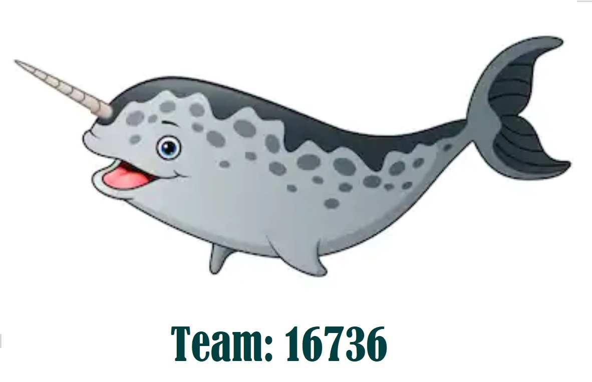

## Welcome!
This repository contains the source to control a *FIRST* Tech Challenge competition robot.  
To use this SDK, download/clone the entire project to your local computer.

**************************************************************************************
# Team 16736 - Atomic Narwahls (2019-2020)
**************************************************************************************

Steps:
 * If you are using windows, create folder c:\dev\sandbox
 * clone repository under here - so it will look like c:\dev\sandbox\ftc_app

**************************************************************************************

## Downloading the Project
* If you are a git user, *FIRST* recommends that you use the --depth command line argument to only clone the most current version of the repository:

&nbsp;&nbsp;&nbsp;&nbsp;&nbsp;&nbsp;&nbsp;&nbsp;&nbsp;&nbsp;&nbsp;&nbsp;git clone --depth=1 https://github.com/team16736/ftc_app.git

* Or, if you prefer, you can use the "Download Zip" button available through the main repository page.  Downloading the project as a .ZIP file will keep the size of the download manageable.

### Javadoc Reference Material
The Javadoc reference documentation for the FTC SDK is now available online.  

&nbsp;&nbsp;&nbsp;&nbsp;&nbsp;&nbsp;http://ftctechnh.github.io/ftc_app/doc/javadoc/index.html    
